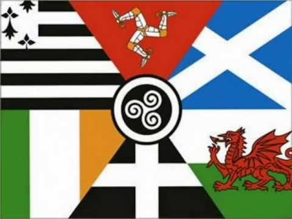

# An Teanga Sean: The Celtic Languages

In the study of European history, there are central and peripheral societies; the central societies lay claim to the Inheritance of Rome, or a progression of the flame of civilization from Cicero to the present day. The Celtic languages – Irish, Cornish, Welsh, Scots-Gaelic, Manx, and Breton – are languages of peripheral societies. These are not continental powerhouses like France or Germany, but small tribes of people on the British Isles. At least, that is the narrative told by the central societies, like the United Kingdom and France. Their legacy is one of oppression; whether it was Romans in antiquity, Vikings in the medieval period, or Norman Englishmen, the peoples of the Celtic languages have been oppressed and assaulted by foes for centuries.

The Irish, with their monastic ecclesiastical orders and scriptoria brimming with the wisdom of the ancients, speak Gaelic, or Irish, as it is often called. This language has seen the hand of the English in action; the invading English tried to outlaw it, and when Ireland rose in resistance during the 19th and 20th centuries, Gaelic-speaking nationalists led the fight.

Cornish, spoken mostly in academic interest in 21st century Cornwall in the south of England, died out in the 18th century, though there was a revival effort in the late 20th century.

Welsh holds its standing in Wales as a governmentally recognized national language; Welsh citizens have the right to treat with the United Kingdom in Welsh.

Scots-Gaelic, the language of the Celtic peoples in mostly Highland Scotland, bears subtle reminders of the common kinship of the Irish and the Scottish.

Manx has little more than a well-attended fan club in the Isle of Man, one of the many small islands between Ireland and Britain.

Breton died out in Brittany, France, though revival efforts are underway and children are increasingly attending bilingual schools where some instruction is in Breton.
