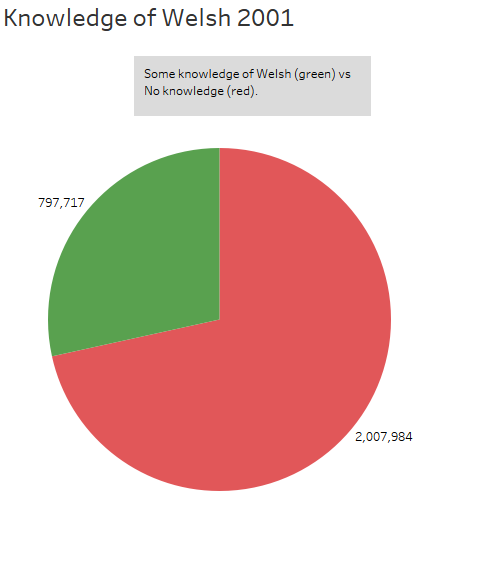
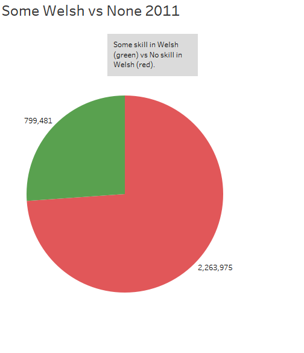
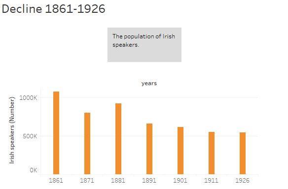

# Visualizations & Analysis

### Celtic Languages in the United Kingdom

Here only England is seen, and the numbers of people in each category of Celtic language numbers less than 10,000, some dramatically so. I would appear clearly here that Welsh is the predominant language aside from English in England, trailed by Irish, and then Cornish. It should be noted that due to the questionnaire, the Gaelic which is not otherwise specified may include people confused as to whether they speak Cornish, or Scots-Gaelic, or Irish, or even Breton. This is unclear, and a consequence of working with self-reported data.

---

### Knowledge of Welsh in Wales

Here are two pie charts which compare the proportion of people who have some skill in Welsh with the people in Wales who lack any skill. It is worth noting that this particular pie chart style allows us to see the nearly 25% portion of the total population which speaks, reads, or writes Welsh (or any combination thereof).

![alt text]imgs/Prevalence%20of%20Welsh%202001.png)

This chart explains basically the same information as the pies above, but it provides an opportunity to introduce the next graph. In 2001, the UK did not factor the concentration of Welsh between urban and rural settings. In 2011, we see more clearly the spread.

In the left grouping of bars, the population without any skill in Welsh is displayed. Note that urban Welsh people dominate this scale; now compare it to the ones who have some skill in Welsh. There are nearly as many people skilled in Welsh as there are country folks who have no skill in Welsh. It would seem from this graph that urbanization may play a role in Anglicizing Welsh tongues.

---

### Irish in Ireland

In the period from 1861-1926, Ireland saw a surge of nationalism and the proliferation of Irish as a national tongue. However, the view from this graph does not seem to confirm this view. Let’s put it in context with a look at the overall population.

Here we see a steady decline as birth rates struggle to keep pace with crippling poverty and emigration to other nations. As seen below, the percentage of Irish speakers with relation to this overall decline remains relatively constant.

Now to bring it into the modern term. In green are the numbers for 2006, ninety years after the Easter Uprising of 1916. Only five years later in 2011 (orange) we see a sharp increase in all but a certain age group: 15-34-year-old Irish people have not been visiting their grandmothers, it would seem. Or at least, they are insisting on English when they visit. It would be interesting to gain access to more information from the Republic of Ireland and see if this bubble exists in the 1990’s, and it will be interesting to see in twenty to thirty years if this trend holds.

---

### The Michael Krauss Collection and The Cornish Language Revival

As for the Cornish dataset, I noticed a clear uptick in the 1970’s. This coincides with much of the efforts put forward by the Cornish people to see their ancient nation and language legitimized. It would certainly be interesting to utilize the rest of the collection to get an even better idea of the movement and identify more data points. With more data, the certainty with which we can infer trends increases, and as scholarship from this period is collected by archives as the scholars themselves retire, it would be immensely useful to see these kinds of collections digitized so we can ask bigger questions.
